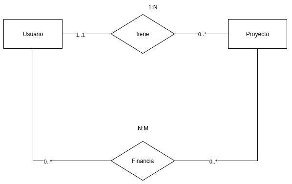
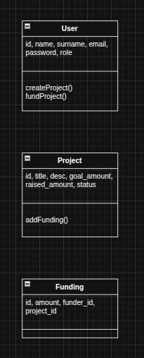

# Trabajo Práctico Final - Backend (Plataforma de Crowdfunding)

Plataforma de financiamiento colectivo para proyectos de emprendedores locales, donde empresas o el municipio pueden aportar fondos.

---

## Instalación

git clone https://github.com/tuusuario/impulso-local-backend.git
cd tp-final-backend
npm install
cp .env.example .env
npm run dev

## Endpoints Principales

# Auth

| Método | Ruta           | Descripción         |
| ------ | -------------- | ------------------- |
| POST   | /auth/register | Registro de usuario |
| POST   | /auth/login    | Inicio de sesión    |

# Projects

| Método | Ruta      | Descripción      | Rol         |
| ------ | --------- | ---------------- | ----------- |
| POST   | /projects | Crear proyecto   | Emprendedor |
| GET    | /projects | Listar proyectos | Público     |

# Funding

| Método | Ruta                 | Descripción        | Rol                     |
| ------ | -------------------- | ------------------ | ----------------------- |
| POST   | /fundings            | Financiar proyecto | Empresa / Municipalidad |
| GET    | /fundings/:projectId | Ver aportes        | Público                 |

## Servidor Socket

El socket lo unico que hacer es emitir un evento funding:created cuando se crear un nuevo financiamiento

{
"message": "Nuevo financiamiento creado",
}

## Arquitectura del proyecto

ORM: Sequelize (MySQL)

Autenticación: JWT + Passport

Validaciones: Joi

WebSockets: Socket.IO

Estructura por módulos: Users, Projects, Fundings

## MER

Entidades:

- Usario(id, name, surname, email, password, role)
- Proyecto(id, title, description, goal_amount, raised_amount, status, user_id)
- Financia(id, amount, funder_id, project_id)

Relaciones:

- Un User tiene muchos Projects.
- Un Project tiene muchos Fundings.
- Un Funding pertenece a un User (funder) y un Project.

## UML

## Casos de Uso

Actores:

Emprendedor
Empresa
Municipalidad

Casos:

Registrar usuario
Iniciar sesión
Crear proyecto
Financiar proyecto
Ver proyectos
Recibir notificación (Socket)

## Secuencia (Financiamiento)

Empresa -> API Backend: POST /fundings
API Backend -> DB: INSERT funding
API Backend -> DB: UPDATE project.raised_amount
API Backend -> Socket.IO: emit("funding:created")
Socket.IO -> Emprendedor: Notificación recibida